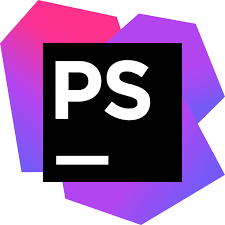
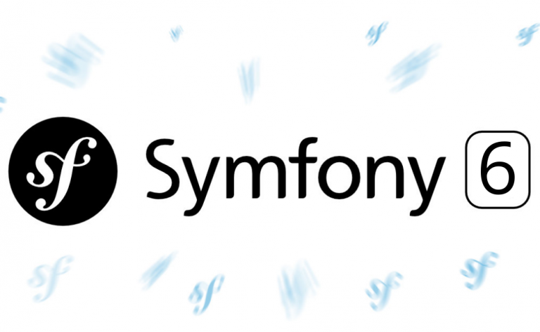
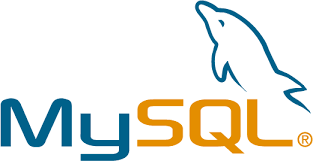
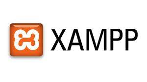

# Les vins de bourgogne

Afin de découvrir PHP6 et mettre en application mon apprentissage chez O'clo
j'ai créé ce projet.
Ce projet est réalisé sous environnement Windows

### Pré-requis

Ce qu'il est requis pour commencer avec votre projet...

- XAMPP avec PHP 8, Apache et MySQL
- Composer
- CLI Symfony

### Installation

Les étapes pour installer votre programme....

 Executez la commande ``Symfony new lesvinsdebourgogne --webapp`` 
 
 Ne voulant pas utiliser webpack encore installer d'office avec 
 Symfony 6, j'ai retiré "symfony/webpack-encore-bundle": "^1.12" 
 dans le fichier composer.json.
 Puis j'ai supprimé mon dossier asset désormais vide.
 Enfin executez la commande ``composer remove webpack``

## Démarrage

Executez la commande ``Symfony serve``

## Fabriqué avec
<code></code>
<code></code>
<code></code>
<code></code>
<code></code>

## Auteurs

* **Justine Strescher** 

